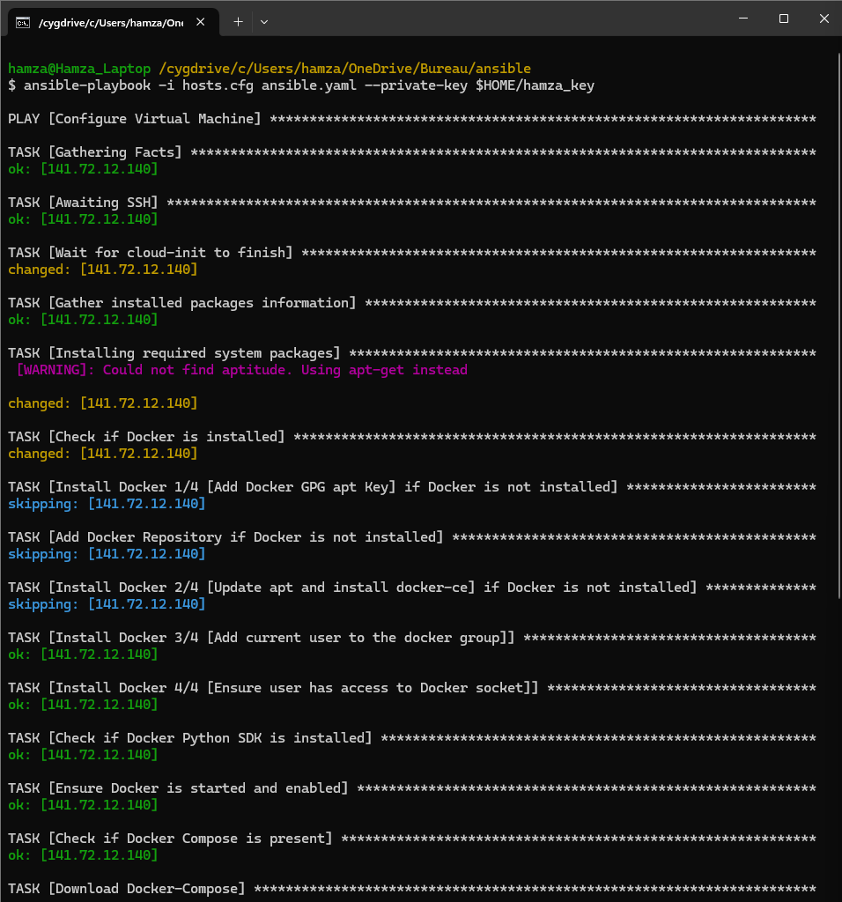
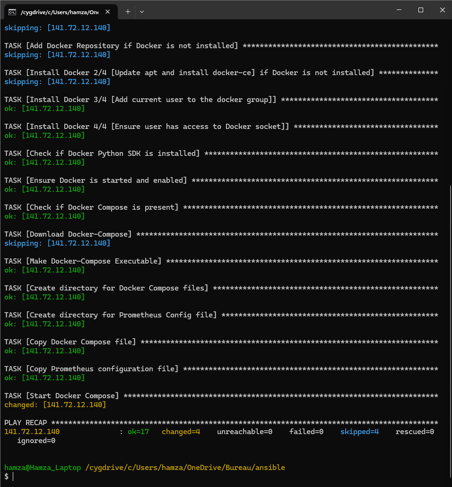

# IoT Project-Team D Part

| Hamza Harti | Etienne Imsirovic | Lisa Tawackoli | Vladislav Neufeld |

##  1. Architecture

|  | 
|:--:| 
| *Architecture Team D Overview* |

##  2. Project Structure

```html
Ansible/                   <!--Main Directory-->
┣ docker_compose/          <!--Directory for Docker Implementation-->
┃ ┣ docker-compose.yaml    <!--Configuration file for Docker-compose-->
┃ ┗ prometheus.yaml        <!--Prometheus Configuration file-->
┣ img/                     <!--Media for Documentation-->
┃ ┣ Ansible_Part1.png
┃ ┣ Ansible_Part2.png
┃ ┗ Architecture-TeamD.svg
┣ key/                     <!--SSH Key Directory-->
┃ ┗ hamza_key              <!--SSH Private Key-->
┣ ansible.cfg              <!--Ansible Configuration file-->
┣ ansible.yaml             <!--Ansible-playbook-->
┣ hosts.cfg                <!--Hosts file with the IP Addresses-->
┣ hosts.tpl                <!--Template file for Hosts.cfg-->
┗ README.md                <!--Documentation-->
```

##  3. Implementation

```bash
# Run Ansible Playbook
ansible-playbook -i hosts.cfg ansible.yml --private-key key/hamza_key.pm
```
|  |
|:--:| 
| *Ansible Output Terminal* |
