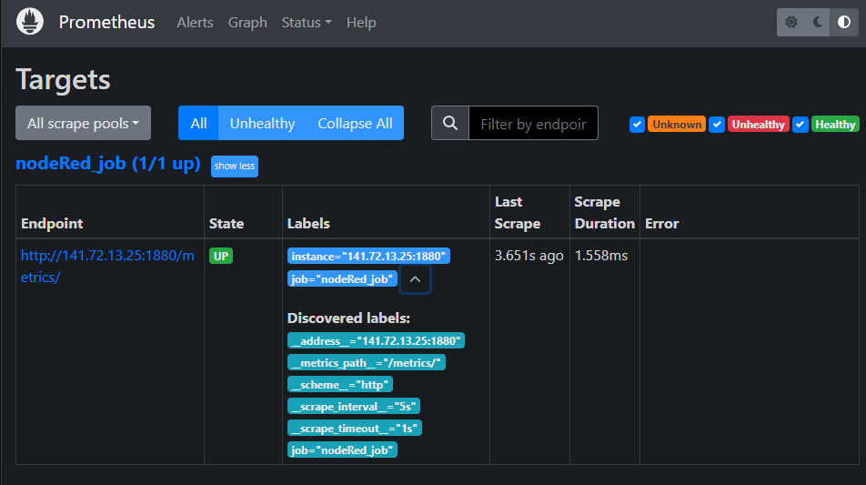

# IoT Project-Team D Part

| Hamza Harti | Etienne Imsirovic | Lisa Tawackoli | Vladislav Neufeld |

##  1. Architecture

The architecture involves a coordinated flow of data, utilizing a combination of Prometheus and InfluxDB. Node-RED generates and exposes measurement data via a /metrics endpoint, which is then scraped by Prometheus running in a Docker environment within a virtual machine. Prometheus captures real-time data, while InfluxDB stores persistent data—pushed by Node-RED—for long-term analysis. This data is then visualized and monitored through Grafana, which retrieves both real-time and historical metrics for analysis.

A key component of the setup is Ansible, managed from a personal laptop via an SSH connection secured with a private key, which automates and manages configurations within the virtual machine. The setup also leverages a secure VPN connection to ensure data integrity and privacy throughout the process. This architecture efficiently handles both short-term and long-term data for monitoring, analysis, and troubleshooting.

|  | 
|:--:| 
| *Architecture Overview* |

##  2. Project Structure

```html
Ansible/                   <!--Main Directory-->
┣ docker_compose/          <!--Directory for Docker Implementation-->
┃ ┣ docker-compose.yaml    <!--Configuration file for Docker-compose-->
┃ ┗ prometheus.yaml        <!--Prometheus Configuration file-->
┣ img/                     <!--Media for Documentation-->
┃ ┣ Ansible-Blocks.png
┃ ┣ Ansible_First_Block.png
┃ ┣ Ansible_Fourth_Block.png
┃ ┣ Ansible_Part1.png
┃ ┣ Ansible_Part2.png
┃ ┣ Ansible_Second_Block.png
┃ ┣ Ansible_Third_Block.png
┃ ┣ Architecture-TeamD.svg
┃ ┣ InfluxDB_Docker_Compose.png
┃ ┣ Prometheus_Config_File.png
┃ ┣ Prometheus_Docker_Compose.png
┃ ┗ Prometheus_UI.png
┣ key/                     <!--SSH Key Directory-->
┃ ┗ hamza_key              <!--SSH Private Key-->
┣ ansible.cfg              <!--Ansible Configuration file-->
┣ ansible.yaml             <!--Ansible-playbook-->
┣ hosts.cfg                <!--Hosts file with the IP Addresses-->
┣ hosts.tpl                <!--Template file for Hosts.cfg-->
┗ README.md                <!--Documentation-->
```

##  3. Implementation

### Ansible

Starting from a local linux machine, and having ansible installed, you can run the following commands to start the ansible playbook. 

```bash
# Change directory to Ansible
cd ansible

# Run Ansible Playbook
ansible-playbook -i hosts.cfg ansible.yaml --private-key key/hamza_key.pm
```
The playbook is divided into 4 Blocks, each block has a set of tasks.

#### Block 1: Establish Connection to Virtual Machine 

This block of the Ansible playbook establishes an SSH connection to the target virtual machine and waits for the `cloud-init` process to complete, ensuring the VM is fully initialized. Once the connection is established, the playbook gathers information about the packages already installed on the system. After collecting this data, it proceeds to install a set of necessary system packages, including `git`, `curl`, `python3`, and others, ensuring they are up to date and ready for use. This sequence prepares the VM for further configuration or deployment tasks.

|  | 
|:--:| 
| *Tasks of the First Block* |

#### Block 2: Install and Configure Docker
 
This block of the Ansible playbook checks if Docker is installed on the target system by running the `docker --version` command. If Docker is not found, the playbook proceeds to install and configure Docker. It starts by adding the Docker GPG key and repository to the system, allowing Docker packages to be downloaded. Next, it updates the package list and installs the latest version of Docker Community Edition. Once Docker is installed, the current user is added to the Docker group, enabling them to use Docker without root privileges. Finally, the playbook ensures that the user has access to the Docker socket by adjusting the file permissions for `/var/run/docker.sock`.

|  | 
|:--:| 
| *Tasks of the Second Block* |

#### Block 3: Prepare Docker Tools and Environment

This block of the Ansible playbook prepares the Docker tools and environment after Docker has been installed. First, it ensures that the **Docker Python SDK** is installed using `pip`, enabling Python-based interaction with Docker. Next, it checks whether Docker is running and ensures that it is both started and enabled at boot using `systemd`. The playbook then verifies if **Docker Compose** is already present by checking the file path `/usr/bin/docker-compose`. If Docker Compose is not found, it downloads the latest version from GitHub. Finally, the playbook ensures that Docker Compose is executable by setting the appropriate file permissions.

|  | 
|:--:| 
| *Tasks of the Third Block* |

#### Block 4: Prepare and Run The Docker Containers

This block of the Ansible playbook prepares and runs Docker containers for **Prometheus** and **InfluxDB**. It begins by creating a directory at `/opt/docker` to store the Docker Compose files and a separate directory for the Prometheus configuration at `/opt/docker/prometheus`. The Docker Compose file is then copied from the local machine to the `/opt/docker` directory, followed by copying the Prometheus configuration file to the same directory. Finally, the playbook runs `docker-compose up -d` to start the containers for Prometheus and InfluxDB in the background, ensuring the services are up and running.

|  | 
|:--:| 
| *Tasks of the Fourth Block* |

|  |
|:--:| 
| *Ansible Output Terminal* |

### Prometheus

This section of the Docker Compose file defines the configuration for the **Prometheus** service. The latest Prometheus Docker image is used, and the container is named `prometheus` for easy identification. Two volumes are specified: one for mounting the **Prometheus configuration file** from the host system to the container at `/etc/prometheus/prometheus.yml`, and another for storing Prometheus data in a persistent volume called `prom_data`. The service exposes Prometheus on **port 9090**, allowing external access for monitoring and querying. The container is set to restart automatically unless manually stopped. Additionally, the Prometheus configuration file is explicitly referenced via a command to ensure it is correctly used within the container.

|  | 
|:--:| 
| *Prometheus Service in Docker Compose* |

|  | 
|:--:| 
| *Prometheus User Interface* |

The Prometheus configuration file defines how Prometheus collects metrics from specific targets. In this case, a scrape job named `nodeRed_job` is set up to collect metrics from a **Node-RED** instance. The job has a **scrape interval** of 5 seconds, meaning Prometheus will pull metrics from the target every 5 seconds, and a **scrape timeout** of 1 second, allowing up to 1 second for each collection attempt. The metrics are exposed at the `/metrics/` path over **HTTP**. The specific target for this job is the Node-RED instance running on the IP address `141.72.13.25` and port `1880`. The configuration also ensures that Prometheus honors any timestamps provided with the metrics, keeping the data accurate.

|  | 
|:--:| 
| *Prometheus Configuration File* |

### InfluxDB

This section of the Docker Compose file defines the **InfluxDB** service configuration. The **latest InfluxDB image** is used, and the container is named `influxdb` for easy identification. The service exposes InfluxDB on **port 8086**, making it accessible for data storage and queries. The container is set to automatically restart unless it is manually stopped, ensuring reliability. Several **environment variables** are defined, including the database name (`IoT`), admin user credentials, and user credentials for regular database access. The data is persisted using a Docker volume named `influxdb-data`, which maps to the InfluxDB data directory `/var/lib/influxdb`, ensuring that data is stored even if the container is restarted or removed.

|  | 
|:--:| 
| *InfluxDB Service in Docker Compose* |


